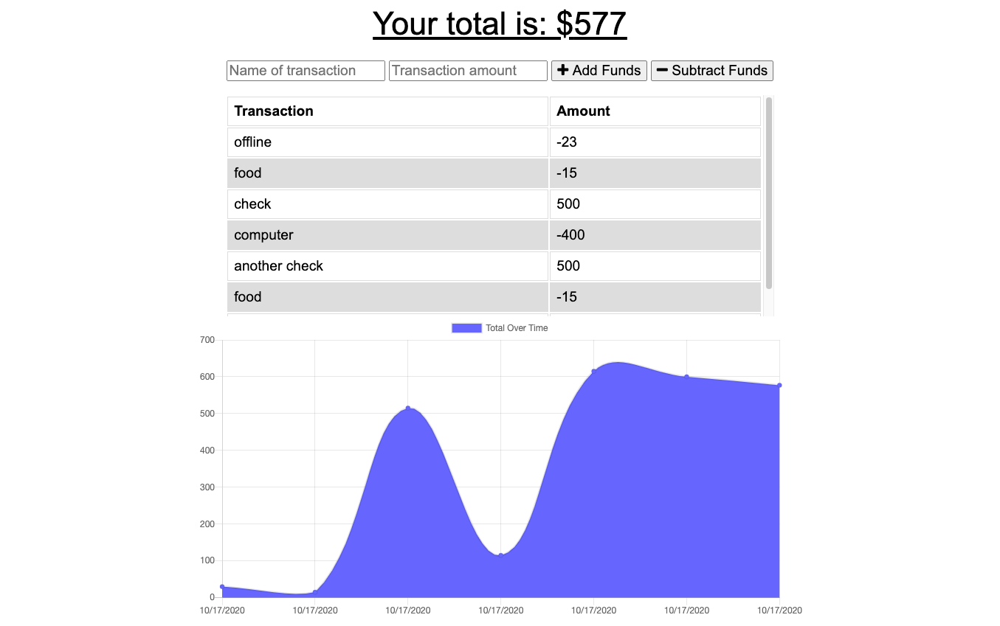

# Budget Tracker
      
    


## Description

This workout tracker application lets you keep track of the exercises you have accomplished over the course of a week. By using a Mongodb database and Mongoose, the user is able to add different types of exercises, update them, and keep track of their exercises by means of clean, interactive charts and forms. This app utilizes MongoDB, Mongoose, Express, Express router, Node.js, and more.

## [Click Here to check it out!](https://young-woodland-55260.herokuapp.com/)


​


## Table of Contents

* [Installation](#installation)
* [License](#license)
* [Questions](#questions)


## Installation

To install necessary dependencies, run the following command:

``` npm i ```


## License

This project is licensed under the APACHE 2.0 license.


## Questions

If you have any further questions, you can reach me directly here: lovins.jacob@yahoo.com

You can find more of my work at [https://github.com/jacoblovins/](https://github.com/jacoblovins/).